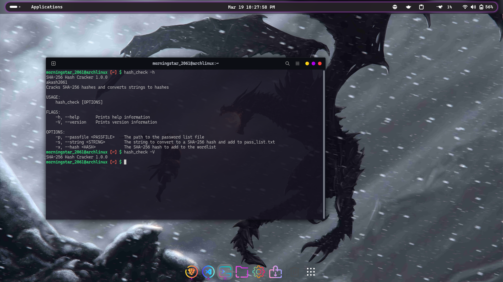
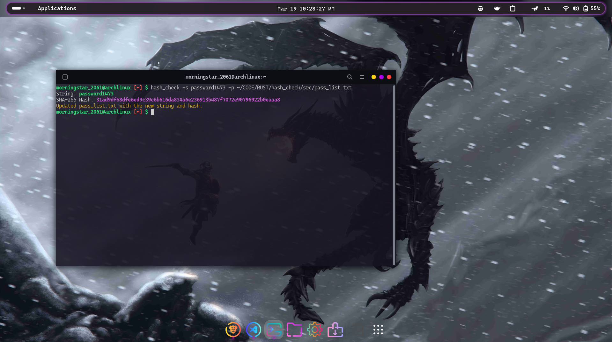
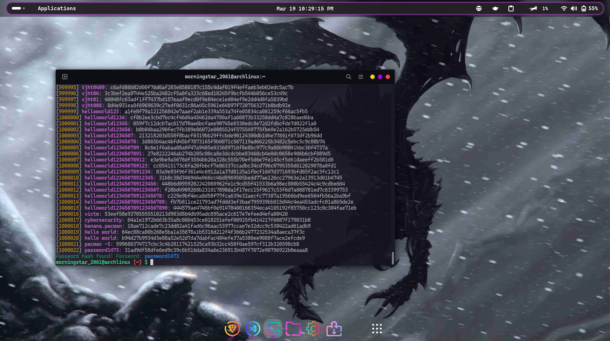
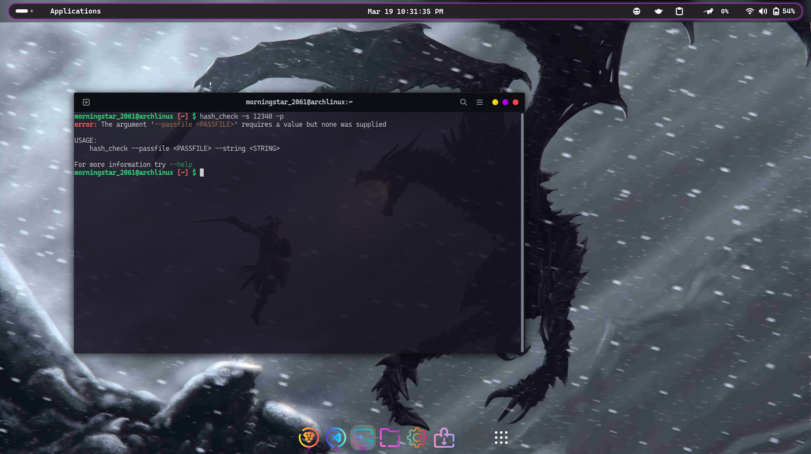

# Password-Hash Checker Built in Rust 🦀

## Overview
This project is a simple tool built in Rust for converting a string to its SHA-256 hash and finding the hash of a string using a password list. It utilizes the SHA-256 hashing algorithm to securely hash strings and compares them against a provided list of hashed passwords to find matches.

## Description
This Rust-based CLI tool offers two main functionalities:
1. **String to Hash Conversion**: It converts a provided string into its corresponding SHA-256 hash.
2. **Hash Checking**: It compares a given SHA-256 hash against a list of hashed passwords to determine if there's a match.

## Crates Used:
+ clap = "v2.33"
+ colored = "v2.1.0"
+ sha2 = "v0.10.8"

## Where It Works
This tool is useful for anyone looking to securely hash strings or check passwords against a known list of hashed passwords. It can be used by developers, security professionals, or anyone concerned with password security.


## Installation
### Prerequisites
Make sure you have Rust installed on your system. If not, you can download it from [rust-lang.org](https://www.rust-lang.org/).

### Installation
1. Clone this repository:
    ```bash
    git clone https://github.com/akash2061/RUST-Hash-Checker.git
    ```
    ```bash
    cd RUST-Hash-Checker
    ```

2. Build the project:
    ```bash
    cargo build --release
    ```

3. Run the application:
    ```bash
    cargo run --release
    ```

### Or Use Released Version

1. Go to the [Releases](https://github.com/akash2061/RUST-Hash-Checker/releases) page or Directly [Download](https://github.com/akash2061/RUST-Hash-Checker/releases/download/v1.0.0/hash_check) the latest version.
2. Download the latest release for your platform.
3. Open your terminal and navigate to the folder where the executable is downloaded.
4. Copy the executable to the `/usr/local/bin` directory using the following command:

    ```bash
    sudo cp ./hash_check /usr/local/bin/
    ```


Now you can check hash and password from any terminal window by simply typing its name `hash_check`, thanks to its location in `/usr/local/bin`.

### Download [pass_list.txt](https://github.com/akash2061/RUST-Hash-Checker/releases/download/v1.0.0/pass_list.txt) file for 1,00,000+ passwords.

## Usage
### Convert a String to Hash
```bash
hash_check -p "path_to_password-file.txt" -s "hello world"
```
### Convert a Hash to String
```bash
hash_check -p "path_to_password-file.txt" -x " b94d27b9934d3e08a52e52d7da7dabfac484efe37a5380ee9088f7ace2efcde9"
```
### Version & Help:


### String to Hash:


### Hash to String:


### Error-Handling:


## Dependencies

This project uses the `sha2` crate for hashing functionality and `clap` for command-line argument parsing. Both dependencies are managed via Cargo, the Rust package manager.

## Contribution

Contributions are welcome! If you encounter any issues or have suggestions for improvements, feel free to open an issue or submit a pull request.

## License

This project is licensed under the MIT License. See the [LICENSE](LICENSE) file for details.

